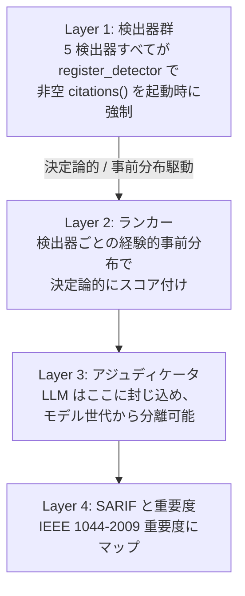

# Citation as API: design constraints of an evidence-bound static analyser

Stage 2 essay, v0 draft.
Status: skeleton with thesis sentences, claim mapping to concrete cntrdct
file references, and open questions for the open-question section. Word
count is well under the 4000-6000 target for an Onward! Essays submission;
this draft is intended to be expanded after Stage 1 reception data
arrives, not before.

## Abstract

Static analysis tools carry implicit authority. Their findings are
trusted by reviewers, gated on by CI, and increasingly fed into
downstream automation and AI agents that act with little human review.
That authority is rarely defended. Most tools document their detectors
in prose, point at design choices in commit messages, or rely on the
reputation of the analyser's authors. This essay presents a contrarian
position: that peer-reviewed citation, treated as a typed and enforced
component of every detector, produces design constraints that ripple
through the entire tool architecture in useful and non-obvious ways.
The cntrdct project is the worked example. We describe four claims
about what falls out of an enforced citation API, sketch one open
question about how such a tool should behave when its citation graph
decays, and argue that the constraint is worth the cost.

## 1. Introduction

The 2024-2026 wave of LLM-assisted code review has changed the implicit
contract between an analyser and its consumer. A pull-request comment
generated by a language model looks identical to one generated by a
deterministic analyser, and both arrive in the reviewer's queue with the
same visual weight. The deterministic analyser used to be the default
authoritative source; it now competes with high-volume, plausible-
sounding, ungrounded suggestions. Reviewers triage. Some defer to the
plausible suggestions because they look confident. Some ignore both
because the cost of distinguishing has risen.

The position taken in this essay is that the deterministic analyser can
defend its authority by making its evidence explicit and machine-
checkable. Specifically: every detector in the analyser must reference
peer-reviewed prior art, those references must be present at the type
level so that a detector without citations cannot be registered, and
the bibliography must be testable against the source so that
documentation drift between the code and its claimed evidence is a
build failure rather than a code-review concern.

This is the design discipline that shaped cntrdct. The codebase's five
Layer 1 detectors (clone-drift, arg-swap, comment-code,
unreachable-after-terminator, config-interaction) each cite a published
paper or a venue-specific case study. The discipline is encoded in the
type system: `register_detector` rejects implementations whose
`citations()` returns an empty slice. A consistency test holds the
top-level `CITATIONS.md` and the per-detector `citations()` methods in
lock-step. None of this is novel as plumbing. What is interesting is
what it costs and what it produces.

We describe four claims (C1-C4) about what the discipline yields, plus
one open question (C5) about its long-term failure mode. Each claim is
illustrated with a specific code path or test in cntrdct that shows the
discipline in action. The aim is to give a reader who has never seen
the codebase enough to either accept the position or pose a concrete
counter-example.

### 1.1 Architecture at a glance

The discipline described above maps onto a four-layer architecture.
Layer 1 holds the deterministic detectors with their bound
citations. Layer 2 turns detector outputs into a ranking using
empirical priors. Layer 3 isolates any LLM-mediated adjudication.
Layer 4 produces SARIF for downstream consumers. The diagram fixes
the direction of dependency and the position of the type-level
citation gate.

The arrows are one-way. No layer above can influence the layer
below; in particular, the adjudicator at Layer 3 cannot suppress a
detector at Layer 1, which is what makes the model-version
isolation argument in claim C2 work. The type-level citation gate
is the constraint on entry to Layer 1: a detector that does not
return a non-empty `citations()` slice never reaches the runtime.
The four claims that follow each pin a specific feature of this
shape — the gate (C1), the strict downward arrows (C2), the
empirical scoring at Layer 2 (C3), and the composition of all
three into outside-auditable claims (C4).

## 2. Claim C1: type-level citation enforcement is not cosmetic

Citation enforcement is often imagined as documentation: a `--cite`
flag on the analyser's CLI, or a section in the user manual. cntrdct
puts the requirement at the trait level. A detector implementor must
return a non-empty `&'static [Citation]` from `citations()` before the
detector can be registered with the runtime. The check runs at startup
and panics if violated. The implementation is small (see
`crates/core/src/lib.rs` `register_detector` for the runtime guard).

The non-obvious effect is on detector authoring order. To pass startup,
the implementor must commit to an evidentiary standard before writing
any detection logic. The first commit that adds a new detector is
literally the bibliography commit; the detection rules come later. This
inverts the usual order in which lints are written, where the heuristic
is built, then the documentation is added, then the rationale is post-
hoc reconstructed. With type-level citation, the rationale comes first.

Two consequences follow. First, detectors that cannot be grounded in
prior art fail at the design stage rather than at the code-review stage.
The author either finds a paper or stops. Second, the bibliography is
treated as a load-bearing artefact rather than a courtesy. When a paper
is added to `CITATIONS.md`, the consistency test
(`crates/cli/tests/citations_consistency.rs`) verifies that at least
one detector references it; orphaned bibliography entries are a build
failure. The cost is a slower pace of detector additions. The benefit
is that the bar for what counts as a detector is materially higher
than it would be without the constraint.

## 3. Claim C2: LLM containment decouples the analyser from any model version

cntrdct uses an LLM only for adjudication: a post-hoc layer that re-
scores a small subset of high-rank findings using natural-language
context. The LLM is confined to a single crate
(`crates/adjudicator-llm/`) and never invoked by the detectors,
ranker, or calibration code. The detectors and ranker are deterministic
and produce identical output across runs given identical input.

The non-obvious benefit is reproducibility detached from model
versions. A reader of a future cntrdct paper can, in principle,
reproduce the detector and ranker layers exactly even after the
specific Anthropic / OpenAI / open-weights model used in the
adjudicator has been deprecated or replaced. The adjudicator becomes a
swappable component: a different model, or even a non-model human
review pass, slots into the same interface. The empirical claims of
the analyser at Layers 1-2 do not move when the model moves.

This is not free. The architectural cost is a strict layering: the
adjudicator may not influence detector firing or ranker scoring; it can
only annotate. In a less constrained design, a strong LLM could be
used to filter out false positives at the detector stage, raising
precision. cntrdct deliberately forgoes that option because doing so
would couple Layer 1 results to a specific model version, undermining
reproducibility. The trade is paid in lower precision against the
benefit of long-lived reproducibility. We argue this is the correct
trade for a tool whose primary asset is its evidentiary defensibility
rather than its peak performance on any single benchmark.

## 4. Claim C3: empirical priors make the analyser falsifiable

The Layer 2 ranker in cntrdct sorts findings by a posterior that
combines per-detector empirical priors with the finding's local
features. The priors are not constants; they come from a labelled
corpus, computed via the Wilson lower bound on per-detector precision
plus a Laplace posterior smoothing
(`crates/calibration/src/lib.rs`). The `cntrdct calibrate` subcommand
recomputes the priors from a JSONL labelling file and writes them to
disk. The runtime ranker reads them on startup.

The consequence is that the analyser's per-detector confidence is
falsifiable. If a future evaluator labels a new corpus and finds that
clone-drift's precision drops, the new prior file shifts clone-drift
findings down the ranker. The shift is visible in the public output
rather than buried in an internal severity classification. A user who
disagrees with cntrdct's confidence in a detector can produce their own
labelled corpus, run `cntrdct calibrate`, and the ranker yields to the
new evidence.

Compare this to the conventional approach where each lint carries a
hardcoded severity (`error`, `warning`, `note`). The hardcoded value
is unfalsifiable in the sense that no external evidence will move it
short of a maintainer accepting a pull request. With empirical priors,
external evidence is the mechanism. The discipline pushes back against
the temptation to ship intuitions as severities.

## 5. Claim C4: C1-C3 compose into outside-auditable claims

Each of C1-C3 is useful in isolation. Their composition is more
interesting. With type-level citation (C1), every detector traces to
a paper. With LLM containment (C2), every Layer 1-2 result is
deterministic given a fixed corpus and prior file. With empirical
priors (C3), the per-detector confidence is grounded in labelled
data. The composition yields a tool whose every individual claim is
auditable by an outside reviewer with the source code, the corpus,
and the priors alone. There is no opaque internal severity, no
private model verdict, no hardcoded threshold whose origin is "the
maintainer thought so". The audit surface is bounded and public.

This matters for any context where the analyser's findings are used
for high-stakes downstream decisions: regulatory compliance,
safety-critical code review, automated PR gating in supply chains. In
each of those contexts, the question "why did the analyser flag this"
must be answerable in evidentiary terms. With C1-C3 composed, the
answer is a citation, a deterministic detection rule, and a numeric
prior with its corpus provenance. None of those three depend on
trusting the analyser's authors.

## 6. Open question C5: what to do when the citation graph decays

Papers age. They get superseded by follow-ups, contradicted by later
empirical work, or in extreme cases retracted. An evidence-bound
analyser whose foundations rest on a 2003 paper has a long-tail
exposure that a hardcoded-rule analyser does not. The honest position
is that the discipline is robust against drift in the analyser's own
codebase but vulnerable to drift in its citation graph. We have no
satisfying answer to what an evidence-bound tool should do when its
citation graph decays. We sketch three plausible directions.

### 6.1 Citation freshness as metadata

The simplest direction is to enrich the existing `Citation` struct
(`crates/core/src/lib.rs:120`) with a freshness rating that the
ranker consults during posterior computation. The struct already
carries a `year: u16` field; extending it with a curator-maintained
`freshness: FreshnessRating` enum — say, a three-valued
`Current`, `Watch`, `Stale` — would let the calibration crate
scale the per-detector prior down when the backing citation is on
watch or has been declared stale, and cause `cntrdct scan` to
attach a deprecation marker to findings whose evidence base has
been flagged. The implementation cost is small. The cost that
dominates is curatorial: someone has to track the literature.

The closest analogue is reference-rot in academic publishing. Klein
et al. (PLOS ONE 2014) found that roughly one in five scholarly
articles published between 1997 and 2012 contained a reference URL
that no longer resolved or had silently drifted in content; for
software-engineering analysers whose bibliographies cite both
peer-reviewed papers and project pages, the figure is plausibly
higher. An industrial analogue is the way MDN and TC39 mark
deprecated or superseded specifications: an explicit field that
downstream consumers can consult, maintained editorially by a
small group.

The failure mode is a tension with claim C3. The empirical-priors
discipline says per-detector confidence should track labelled
data, not maintainer opinion. A `freshness` field smuggles
editorial judgment back into the ranker, which is the precise
behaviour C3 was designed to forbid. The mitigation — making
freshness an external input file that the user can override or
recompute from a corpus — is plausible but adds a second prior
file with its own provenance problem. The direction looks
tractable in implementation and problematic in discipline; we list
it first because it is the most likely path the project would take
under deadline pressure, and the most likely to dilute the
existing constraints if attempted without care.

### 6.2 Conflicting-citation resolution

A more ambitious direction is to make the analyser a first-class
participant in evidence conflict. Today, `register_detector`
(`crates/core/src/lib.rs`) accepts a single non-empty `Citation`
slice per detector and treats every entry as supporting evidence.
When a later paper contradicts an earlier one that backs a
detector, the maintainer's options are to retire the detector,
silently swap the backing citation, or accept the contradiction
without comment. None of those map to the publication conventions
of evidence-based fields outside software. The proposal is to admit
a `CitationStance` enum on each `Citation` entry — `Supports`,
`ContradictsPrior`, `SupersedesPrior` — plus a `supersedes:
&'static [&'static str]` cross-reference to other citation keys.
The calibration path in `crates/calibration/src/lib.rs` would then
weight the prior by stance: contradicting evidence pulls the
posterior toward zero; superseding evidence overrides the
predecessor; the per-detector confidence is no longer a function
of a single paper.

The natural analogue is the GRADE framework in evidence-based
medicine, which formalises how a systematic review combines
heterogeneous primary studies. Cochrane Collaboration review
protocols rely on a named statistic, I², that quantifies
between-study heterogeneity and dictates whether a meta-analysis
is warranted at all. Software-engineering analysers have no such
machinery; the field treats each detector's primary citation as
definitive even when later work argues otherwise.

The failure mode is competence. Detector authors are software
engineers; meta-analysts are statisticians, and the population is
near-disjoint. Worse, the weighting scheme — recency, venue,
citation count, replication status — is itself unfalsifiable in
the sense C3 makes precise. No labelled corpus tells us "venue X
papers outweigh venue Y papers by factor k". A serious version of
this direction would need to commit to a weighting scheme up
front, treat that commitment as part of the preregistered
methodology, and accept that the methodology will be argued with;
otherwise the analyser quietly inherits whatever weights the
maintainer happened to favour, which is C3's failure mode in a new
costume.

### 6.3 A meta-detector on citation staleness

The third direction inverts the usual relationship: the analyser
becomes a finding-emitter against its own bibliography. We add a
new crate, `crates/detector-citation-staleness/`, whose detection
target is the workspace `CITATIONS.md` and the per-detector
`Citation` slices read out of `crates/core/src/lib.rs`. At scan
time, the meta-detector emits a Layer 0 finding for any citation
whose `year` field is older than N years and which has had no
follow-up citation in a maintainer-curated index of the
literature. The SARIF emitter (`crates/sarif/`) tags these with a
distinguishing rule identifier so users can suppress them
selectively; the default severity is `note`, not `warning`, so the
meta-detector annotates rather than gates.

The closest software-engineering analogue is dependency aging. Cox
"Surviving Software Dependencies" (CACM 2019) argued for treating
dependencies as a maintained surface rather than a one-time
choice; the OpenSSF Scorecard project operationalises this by
emitting "this project has not been updated in N months" signals
on package repositories. A meta-detector on citation staleness is
the same pattern lifted from code dependencies to evidence
dependencies: the analyser's bibliography is itself a maintained
surface, and its decay is something a tool can surface
deterministically rather than something a curator must remember to
audit.

The failure mode is recursive. The threshold N — five years? ten?
— is a maintainer choice, not an empirical one, which threatens
to recreate exactly the kind of unfalsifiable knob that C3 was
designed to forbid. The interesting move is to refuse the
maintainer preference and instead ship N as a calibrated prior. A
small labelled corpus of "this 2003 paper is still load-bearing"
versus "this 2003 paper was superseded by a 2018 follow-up" turns
the threshold into a falsifiable parameter that yields to
evidence. That promotion turns the staleness meta-detector into a
research artefact in its own right: a Phase-2-style empirical
study whose subject is the analyser's own evidence graph rather
than a user codebase.

### 6.4 Which direction is most promising

If forced to pick one of the three to ship, it is 6.3. The case is
partly aesthetic — we are not aware of any deployed static
analyser that audits its own bibliography, and the absence is
itself evidence that the move is non-obvious — but the more
substantive case is that 6.3 is the only direction whose failure
mode resolves into a research artefact rather than a methodological
burden. Direction 6.1 produces an editorial knob; direction 6.2
produces a competence problem; direction 6.3 produces a
calibration question whose resolution looks structurally identical
to the empirical-priors discipline already defended in claim C3.
The discipline composes with itself.

We do not commit to 6.3 as this paper's research contribution. The
Stage 2 essay's job is to surface the open question and weigh the
directions; commitment is for a follow-up paper that ships a
labelled staleness corpus and a calibrated threshold. What the
choice of 6.3 does signal is which direction we believe is worth
a Phase 2 corpus and which two are not.

## 7. Related work

Lint authoring practices have been studied empirically (see Sadowski
et al. on Tricorder, the FindBugs / SpotBugs deployment papers).
Citation practices in software documentation are studied by the
community around badging and replication packages. Static analyser
benchmarks (MUBench, Defects4J) discuss reproducibility but do not
enforce citation. The most useful framing is to ask, of every
general-purpose static analyser we know of, three questions:

- (a) Does the tool ship a bibliography at all — that is, do users
  receive references to peer-reviewed prior art alongside the
  binary?
- (b) Is the bibliography tied to specific detection rules — can a
  user look up which paper backs which lint?
- (c) Is the tie enforced at build or startup time — does a missing
  citation prevent the detector from running?

The table records the answer for six widely deployed analysers plus
cntrdct, with a representative citation for each tool's pedigree.

| Tool | Citation | (a) bibliography? | (b) per-rule? | (c) enforced? |
| --- | --- | --- | --- | --- |
| Tricorder | Sadowski, van Gogh, Jaspan, Soederberg, Winter, ICSE 2015. | Partial — platform paper documents the analyser ecosystem; deployed tool surfaces per-analyser docs but not per-analyser citations. | No — integration is at the analyser-binding level. | No — the platform binds analyses, not their bibliographies. |
| SpotBugs (FindBugs successor) | Hovemeyer & Pugh, OOPSLA 2004. | Indirect — bug-pattern docs cite CWE entries and SEI CERT rules, not academic prior art. | No. | No. |
| Infer | Calcagno et al., NFM 2015. | Partial — project lists publications at the org level; per-checker pages (e.g., the Pulse checker) do not embed citations. | No. | No. |
| NiCad | Cordy & Roy, ICPC 2008. | Yes — the tool is the artefact of a single peer-reviewed paper, so citing the tool effectively cites the paper. | Yes (degenerate: the tool implements one detector, so the tie is 1:1). | No — the runtime does not check a citation field. |
| Semgrep | Semgrep documentation; no canonical peer-reviewed paper. | No — the rule schema has no references field; community rule packs cite OWASP / CWE / blog posts. | No. | No. |
| Coverity | Bessey et al., CACM 2010. | No (commercial) — the published paper documents the company's productisation history rather than a per-checker bibliography. | No. | No. |
| cntrdct | This essay. | Yes — `CITATIONS.md` lists at least one peer-reviewed entry per Layer 1 detector, plus methodological references for the ranker (Layer 2) and adjudicator (Layer 3). | Yes — every `Citation::key` in the source code matches an entry in `CITATIONS.md`, joined by `crates/cli/tests/citations_consistency.rs`. | Yes — `register_detector` rejects implementations whose `citations()` returns an empty slice, and an orphaned bibliography entry is a build failure. |

Three observations follow from the table.

The closest existing analogue is NiCad. NiCad is honest about the
discipline being a 1:1 tie, but it sidesteps the harder problem of a
multi-detector tool's per-detector citation bookkeeping because it
has only one detector. The contribution of the position taken here
is that the same discipline survives a multi-detector tool: each
detector carries its own non-empty citation slice, and the
bibliography file is audited against the source rather than left as
a courtesy artefact.

The pattern across commercial analysers (Coverity, plus the
non-academic positions of Semgrep) is a deliberate trade against
citation enforcement in favour of detector recall and time-to-result
on commercial codebases. The trade is rational when the user is
paying for triaged findings, not for evidence. The position taken in
this essay is that the trade looks different when the analyser's
findings are read by AI agents, by reviewers under review-fatigue
load, or by auditors who must produce evidence for an external
party. In those contexts, evidentiary defensibility is the property
the user actually wanted; the trade should flip.

The remaining academically-rooted tools (Tricorder, SpotBugs,
Infer, NiCad) all could have made citation enforcement a startup
precondition and chose not to. There is no technological obstacle:
all four projects already maintain academic publications, and three
of them ship as multi-detector platforms whose authors clearly know
which paper backs which detector. The decision to leave the binding
implicit is design freedom, not constraint. cntrdct makes the
opposite choice and accepts the cost.

## 8. Threats to position and non-goals

Citation requirements scale poorly to teams without research access.
A small team with no academic library subscription cannot easily add a
detector even when their pattern is common in their own domain.
Cntrdct does not solve this. The position taken is that the cost is
real and is correctly priced. A team that wants to add an evidence-
free detector should fork cntrdct or use a different analyser; the
discipline is not free and is not for everyone.

The position does not claim that an evidence-bound analyser will catch
more bugs than a heuristic-bound one. It claims that the analyser's
findings are easier to defend, audit, and reproduce. Those properties
matter for some use cases (regulatory, safety, supply chain) and
matter less for others (developer-loop linting). We do not argue for
universal adoption.

The position is not anti-LLM. It is about where in the architecture an
LLM is allowed to influence outcome. cntrdct uses an LLM in the
adjudicator and would use a stronger one without changing the
discipline. The constraint is that the LLM is a swappable annotation
layer, not a load-bearing detection rule.

## 9. Conclusion

Static analysis is an accumulating field. Each generation of tools
inherits the assumptions of the previous one. The assumption we
question is that the analyser's authority needs no defence beyond its
maintainer's reputation. We have argued that an evidence-bound
analyser's authority is a function of its citation graph, its
deterministic core, and its public priors. cntrdct is one
implementation; the discipline is portable to any analyser whose
authors are willing to pay its cost. The trade is real. The benefits
compose into a property — outside auditability — that we believe
will become more valuable as AI-assisted code review continues to
flatten the visual distinction between grounded and ungrounded
suggestions.

## Open notes for Stage 2 expansion

- Section 6 has been expanded into four subsections (6.1-6.4) with
  cited adjacent-research analogues and an explicit failure mode
  per direction. Section 6.4 nominates 6.3 (a meta-detector on
  citation staleness) as the most promising research output without
  committing to it as the paper's named contribution; the
  abstract still frames C5 as an open question. If reviewers push
  for a stronger commitment, promote 6.3 in the abstract and §1
  closing.
- Architecture diagram added at section 1.1 (Mermaid, vertical
  layout, Japanese node labels). Annotates the type-level citation
  gate at Layer 1, the deterministic prior-driven edge to Layer 2,
  and Layer 3 as the LLM-confined adjudicator.
- Word count target: 4000-6000. Current draft is about 4075 words,
  inside the target range. Further expansion is optional and
  driven by reviewer feedback rather than by deadline.
- Consider adding a sixth claim: "the discipline produces a corpus,
  not just a tool" — pointing at the Phase 1 labelling artefacts
  that fall out of running the analyser.
- Cross-reference Stage 1 reception data when it arrives. If specific
  objections come up repeatedly from lobste.rs / r/rust / HN, dedicate
  a subsection in section 8 to each.
